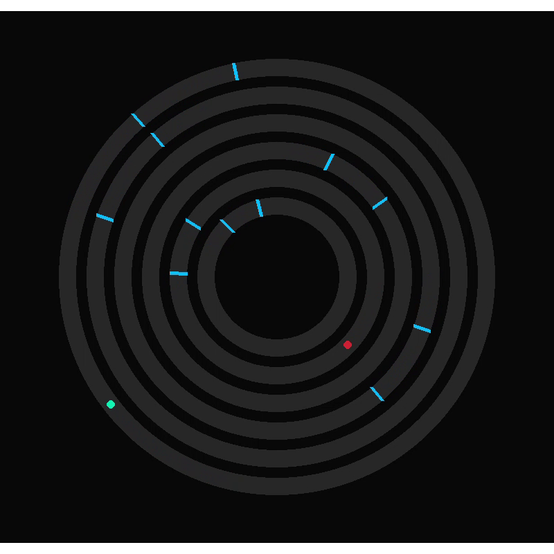

# NÚCLEO

Jogo indie desenvolvido em **Python** com **Pygame**.

O jogador controla uma entidade azul que precisa alcançar o núcleo central,
enquanto inimigos vermelhos, cada um com comportamento próprio, tentam impedir
seu progresso através de camadas circulares conectadas por portais.

---

## 🎮 Gameplay

- Movimento automático sobre anéis circulares
- Portais que conectam diferentes camadas
- Inimigos com IA diferenciada (caçador, flanqueador, bloqueador)
- Sistema de tempo e estados (vitória / derrota)

---

## 🕹️ Controles

- **ESC** → Sair do jogo
- **R** → Reiniciar após vitória ou derrota
- **Fechar janela (X)** → Sair do jogo

---

## 📦 Download (Windows)

➡️ Baixe o instalador na aba **Releases**:

👉 **Releases:**  
https://github.com/lucianorviana75/Projetos_pygame/releases

> ⚠️ Esta versão está marcada como *Pre-release* por ainda estar em evolução.

---

## ▶️ Executar pelo código (modo desenvolvimento)

```bash
pip install pygame
python src/jogo_main_nucleo.py
🏗️ Build

Executável: PyInstaller
Instalador: Inno Setup
Plataforma: Windows

The Game/
├─ src/
│  ├─ jogo_main_nucleo.py
│  ├─ config.py
│  ├─ entities.py
│  ├─ portals.py
│  └─ core.py
├─ assets/
├─ installer/
│  └─ Nucleo.iss
├─ README.md
└─ .gitignore
🔖 Versão

Versão atual: v1.0.0 (Pre-release)


🚧 Status
Projeto em desenvolvimento.
Feedbacks e sugestões são bem-vindos!

👤 Autor
Desenvolvido por LRViana
"# Projetos_pygame"  


